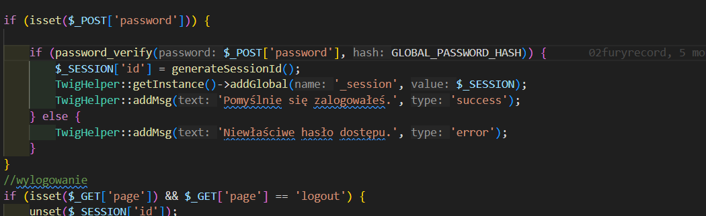
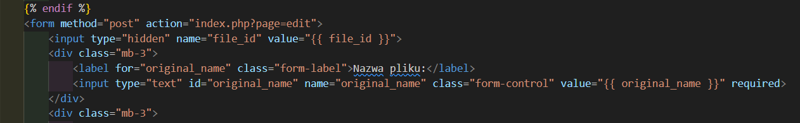
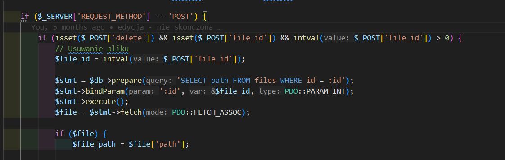

# Zadania

## Zadanie 1 - Atak CSRF - Automatyczne wysłanie formularza
Zadanie polega na:
1.	Przygotowaniu strony z formularzem, który automatycznie wyśle dane po załadowaniu strony lub po kliknięciu przycisku "Wyślij".
2.	Określeniu, że formularz wysyła dane do strony `/index.php?page=edit&edit=`<id pliku>.
3.	Upewnieniu się, że formularz zawiera odpowiednią treść, w tym description z zawartością wskazaną w zadaniu.
4.	***Wskazówka!*** Formularz powinien zawierać następujące dane:
- file_id = `<id pliku>`
- original_name = `<nazwa pliku>`
- description = Chciałbym ogłosić, iż od dziś zostaje Matlab developerem, to moja pasja.
-	Is_public = on (*jeśli chcemy*)
5. Możesz skorzystać z przygotowanego przez nas [formularza](https://github.com/Dawid0508/CSRF-Demo-Security-Lab/tree/main/forms/formularz.html), aby proces zaznajamiania się z istotą tematu szedł sprawniej.
6.	Pamiętaj, że atak CSRF wymaga, by użytkownik był już zalogowany na stronie, a sesja użytkownika była aktywna (np. poprzez ciasteczka).

## Zadanie 2 - Usunięcie pliku z bazy 
Przygotuj stronę z linkiem tak aby zawierała link, który po kliknięciu automatycznie wyśle formularz usuwający plik. Link prowadzi do zewnętrznej strony (np. Google), ale tak naprawdę wywołuje usunięcie pliku na serwerze.
Formularz wysyłający żądanie usunięcia pliku: Formularz ukryty na stronie zawiera następujące dane:
- file_id = <id pliku>  `ID pliku do usunięcia.`
- delete = 1  `Parametr wskazujący, że żądanie dotyczy usunięcia pliku.`  

Wysłanie formularza: Po kliknięciu na link, przez JavaScript, formularz jest automatycznie wysyłany do serwera w celu usunięcia pliku.
Możesz skorzystać z przygotowanego przez nas [formularza](https://github.com/Dawid0508/CSRF-Demo-Security-Lab/tree/main/forms/delete.html), jeśli natrafisz na przeszkody.
## Zadanie 3 - Login CSRF
Kolejnym zadaniem jest umieszczenie w opisie pliku skryptu w JS lub zamieszczenie pliku html, po którego kliknięciu zalogujemy się, pomimo nieposiadania hasła, tym samym pozwalając na to każdemu użytkownikowi, który widzi nasz upload, gdyż ma on mieć pole `is_public` na `on`.   
>**W razie problemów** skorzystaj z [formularza](https://github.com/Dawid0508/CSRF-Demo-Security-Lab/tree/main/forms/login.html), który przygotowaliśmy na potrzeby sprawnego rozwiązania tego zadania i poznania istoty problemu.

## Zadanie 4 – Token CSRF

Token CSRF jest najbardziej popularnym zabezpieczeniem przed atakami CSRF. Polega on na dodawaniu ukrytego pola w formularzu zawierającego losowy ciąg znaków. Tak powiązany token z ciasteczkami sesji pozwala na skuteczną weryfikację zapytań po stronie serwera. Atakujący nie jest w stanie odgadnąć tokenu ustanowionego dla danej sesji, więc każde sfabrykowane zapytanie będzie odrzucane przez serwer.

### 4.1 Generowanie unikalnego tokenu

Aby zabezpieczenie działało poprawnie, należy wygenerować unikalny token przy ustanawianiu nowej sesji, na przykład podczas logowania się przez użytkownika. Warto przechowywać taki token w zmiennej `$_SESSION`.

Gdzieś [w tym](https://github.com/Spren3/FileStorageSite/blob/main/public_html/index.php) miejscu trzeba to zrobić.

### 4.2 Przekazywanie tokenu CSRF klientowi

Następnie należy przekazać token CSRF klientowi. W zapytaniach POST używa się do tego pola input z parametrem hidden. Dzięki temu token będzie przesyłany za każdym razem, gdy używamy konkretnego formularza. Robimy to w formularzu w pliku [tutaj.](https://github.com/Spren3/FileStorageSite/blob/main/public_html/templates/edit.html)

Takie pole może wyglądać w ten sposób:

### 4.3 Walidacja tokenu CSRF

Ostatnim krokiem jest weryfikacja czy dla danego zapytania token jest poprawny (lub czy w ogóle istnieje). Tutaj znowu należy coś dodać do pliku [tutaj](https://github.com/Spren3/FileStorageSite/blob/main/public_html/edit.php).

Można to zrobić gdzieś w tym miejscu (wystarczy prosty if sprawdzający czy token jest prawidłowy lub czy w ogóle istnieje)

Tak zaimplementowany token zabezpiecza użytkownika przed atakami CSRF, można sprawdzić jego działanie przeprowadzając jeden z ataków z poprzednich zadań. Należy jednak pamiętać, że taki token musi być zawarty w każdym zapytaniu generowanym do serwera (np. w każdym formularzu). Dodatkowo aby takie zabezpieczenie miało sens, aplikacja musi być zabezpieczona przed atakami XSS tak aby nie dało się wykraść wartości tokenu.
